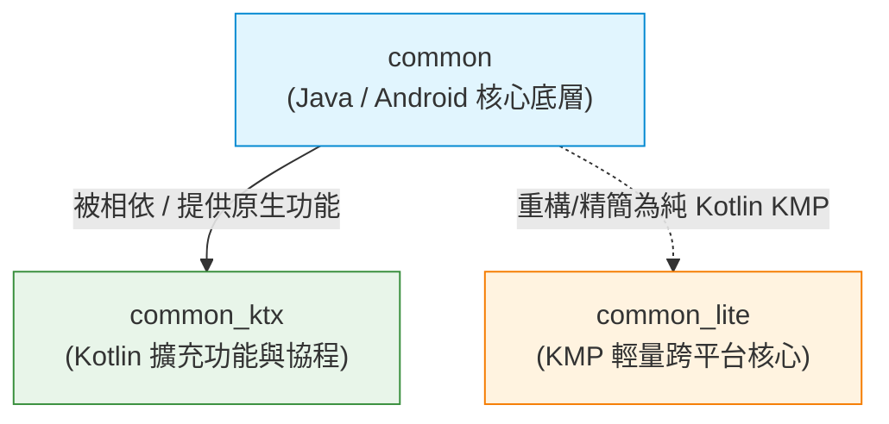

# Media3 `common` 到 `common_lite` (Pure Kotlin / KMP) 深入遷移與架構分析報告

---

## 一、 核心模組架構與演進脈絡

### 1. 三個 Common 模組定位

* **`common` (`media3-common`)**：
  * **語言/平台**：Java / 原生 Android 專用。
  * **特性**：Media3 的歷史核心底層，功能最齊全，但帶有 Google Guava 與 Android Framework (`android.*`) 的強相依性。
* **`common_ktx` (`media3-common-ktx`)**：
  * **語言/平台**：Kotlin / 原生 Android 專用。
  * **特性**：附屬在 `common` 之上的語法擴充層（Extensions, Coroutines, Flow 綁定）。
* **`common_lite` (`media3-common-lite`)**：
  * **語言/平台**：Pure Kotlin / Kotlin Multiplatform (KMP)。
  * **特性**：獨立、零 Guava 依賴的跨平台輕量化 Common 核心，可在 Android、JVM、Desktop 等環境運行。

### 2. 三者差異對比矩陣

| 比較維度 | `common` | `common_ktx` | `common_lite` |
| :--- | :--- | :--- | :--- |
| **主要語言** | Java | Kotlin | Pure Kotlin (KMP) |
| **跨平台支援 (KMP)** | ❌ 僅限 Android | ❌ 僅限 Android |  支援 (Android / JVM / Desktop 等) |
| **Guava 相依** |  高度依賴 (`com.google.common.*`) |  間接依賴 (透過 `common`) | ❌ 完全不使用 Guava |
| **組件完整度** | 100% 完整功能與歷史相容介面 | 附加於 `common` 之上的工具函式 |  輕量化精簡子集 (Subset) |
| **典型發布名稱** | `androidx.media3:media3-common` | `androidx.media3:media3-common-ktx` | `androidx.media3:media3-common-lite` |

### 3. 架構演進圖



---

## 二、 `libraries/common` 源碼精細化 KMP 可行性分類

深入剖析 `libraries/common` 內部上百個 Java 檔案後，將可轉換為 **Pure Kotlin / KMP** 的組件歸類為以下 **5 大純邏輯領域**：

```
libraries/common/src/main/java/androidx/media3/common/
├── 二進位/串流解析器 (Bitstream Parsers)     --> [100% KMP 可行]
├── 高效特化容器 (Specialized Data Structures) --> [100% KMP 可行]
├── 數位音訊 DSP 演算法 (Audio DSP Algorithms) --> [100% KMP 可行]
├── 媒體領域宣告式模型 (Media Domain Models)    --> [100% KMP 可行]
└── 時間/數學/抽象介面 (Time & Math Utilities)  --> [100% KMP 可行]
```

### 1. 二進位 / 位元組 / 串流解析器 (Bitstream & Binary Parsers)
這類組件主要處理媒體格式頭部、NAL Unit 或 Byte/Bit 級別的二進位解析，完全是記憶體內的數學與位元運算：

* **`ParsableByteArray`**：指標驅動（Pointer-driven）位元組緩衝區讀寫器。重構策略：使用 Kotlin 原生 `ByteArray` 與位元移位（`shr`, `shl`, `and`）。
* **`ParsableBitArray`**：位元級（Bit-level）緩衝讀取器，用於解析 H.264/AAC 等標頭。
* **`CodecSpecificDataUtil`**：解析 H.264/HEVC/AV1/VP9/AAC 之 NAL Unit 標頭與特定參數演算法。
* **`ParsableNalUnitArray` / `NalUnitUtil`**：H.264/H.265 的 Exp-Golomb（哥倫布指數編碼）數值解碼演算法。
* **`WavUtil`**：WAV 檔頭格式結構計算與 PCM format 轉換參數計算。
* **`FileTypes`**：MIME Type 與副檔名純對照與推導邏輯。

### 2. 高效基礎數據結構與特化容器 (Foundational Data Structures)
為了避免 Java 裝箱（Boxing）開銷而自行實現的特化容器，無任何平台相依：

* **`CircularIntArray`**：環形整數陣列（純無裝箱 Primitive Int Array）。
* **`LongArray` / `LongArrayQueue`**：長整數動態陣列與 FIFO 佇列。
* **`TimedValueQueue<V>`**：基於 PTS 時間戳記的環形佇列（播放器時間點同步的核心機制）。
* **`CopyOnWriteMultiset<E>`**：純邏輯寫時複製集合。
* **`FlagSet`**：高效整數位元遮罩（Bitmask）狀態集合（用於事件監聽器標記）。

### 3. 數位音訊訊號處理演算法 (Audio DSP & Processing Algorithms)
純數學與 PCM 採樣數據計算，不涉及 Android `AudioTrack` 或硬體：

* **`Sonic`**：Sonic 演算法（時間伸縮 Time-stretching & 變速變調 Pitch-shifting），純數學與短時自相關計算。
* **`ChannelMixingMatrix`**：多聲道下混（Downmixing）與上混（Upmixing）聲道權重陣列轉換矩陣計算。
* **`GainProcessor`**：PCM 音訊增益（Volume/Gain）調整演算法。
* **`ToInt16PcmAudioProcessor`**：8-bit unsigned / 24-bit / 32-bit float PCM 重排與轉 16-bit signed PCM 演算法。
* **`AudioMixingUtil`**：多路 PCM 訊號點對點疊加混合演算法。

### 4. 媒體領域核心宣告式模型 (Media Domain Models)
宣告式的狀態與領域物件，可直接用 Kotlin `data class` / `enum` / `interface` 重新表示：

* **`C`**：核心常數庫（`TIME_UNSET`, `TRACK_TYPE_*`, `ENCODING_*`, Buffer Flags 等）。
* **`Format`**：媒體格式規格描述（Codec, Bitrate, Resolution, Sample rate, Language 等）。
* **`MediaItem` / `MediaMetadata`**：媒體項目定義與標籤元資料（Title, Artist, Artwork URI, ClippedConfiguration 等）。
* **`Timeline`**：播放時間軸模型（抽象 `Window` 與 `Period` 概念）。
* **`AudioAttributes`**：音訊聲道屬性抽象。
* **`PlaybackParameters`**：播放速度與音高。
* **`PlaybackException`**：播放器錯誤碼定義與錯誤傳播。
* **`Tracks` / `TrackGroup` / `TrackSelectionOverride`**：軌道選擇與選擇參數模型。
* **`ColorInfo`**：色彩空間與 HDR 參數（ColorSpace, ColorTransfer, ColorRange）。
* **`VideoSize`**：影片解析度尺寸（Width, Height, UnappliedRotationDegrees）。
* **`Rating` 家族**（`HeartRating`, `PercentageRating`, `StarRating`, `ThumbRating`）：評分系統模型。

### 5. 時間、數學工具與抽象介面 (Time & Math Utilities)

* **`UriUtil`**：URI 相對路徑解析、標準化與規範化（Canonicalization）純字串演算法。
* **`TimestampAdjuster`**：PTS/DTS 時間戳記校正與 33-bit 溢位迴繞（Wrap-around）處理。
* **`Clock`**：時間介面抽象（KMP 下可透過 `kotlinx-datetime` 或 `expect/actual System.currentTimeMillis()` 實作）。
* **`Assertions`**：斷言與參數檢查工具（`checkState`, `checkArgument`）。

---

## 三、 Guava 依賴解耦與 Pure Kotlin 替換策略

在將 `common` 源碼遷移至 `common_lite` (KMP) 時，最關鍵的工程任務是**解耦 Google Guava**：

| Guava 元件 (`com.google.common.*`) | Kotlin KMP 替代方案 |
| :--- | :--- |
| `ImmutableList<T>` / `ImmutableMap<K,V>` | Kotlin 標準庫 `List<T>` / `Map<K,V>` 或 `kotlinx.collections.immutable` |
| `Supplier<T>` / `Function<T, R>` | Kotlin 原生 Lambda 高階函式 (`() -> T`, `(T) -> R`) |
| `Ints` / `Longs` (如 `Ints.checkedCast`) | Kotlin 標準庫擴充函式 `.toInt()`, `.coerceIn()` |
| `Preconditions.checkState / checkNotNull` | Kotlin 原生 `check()`, `require()`, `checkNotNull()` |
| `Objects.equal(a, b)` | Kotlin 原生 `a == b` 操作符 |

---

## 四、 平台強相依組件與隔離策略 (Platform Bound Components)

以下組件強綁定 Android 系統，**不適合直接進入 Pure KMP 通用層 (`commonMain`)**，需保留在 Android 平台層或透過 `expect/actual` 隔離：

1. **OpenGL / GPU 渲染**：
   * `GlUtil`, `GlProgram`, `EGLSurfaceTexture`, `SurfaceInfo`, `GlObjectsProvider`
   * **隔離策略**：留置於 `androidMain` 或 `jvmMain`（使用 JOGL/LWJGL 實現）。
2. **Android 系統服務 / 廣播 / 鎖定**：
   * `AudioFocusManager`, `AudioBecomingNoisyManager`, `WakeLockManager`, `WifiLockManager`, `NotificationUtil`, `NetworkTypeObserver`
   * **隔離策略**：僅存在於 Android 平台實作。
3. **Android 原生序列化 (`Parcelable` / `Bundle`)**：
   * `BundleableByteArray`, `BundleCollectionUtil`, `Bundleable`
   * **隔離策略**：採用 `kotlinx.serialization` 替代 `Bundle` 進行跨平台 JSON/ProtoBuf 序列化。
