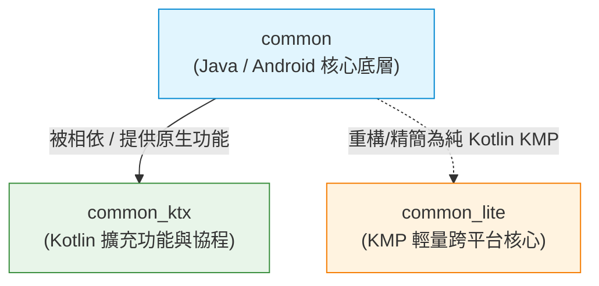

# Media3 Common 模組架構與演進分析

本目錄包含 AndroidX Media3 框架中 `common`、`common_ktx` 與 `common_lite` 三個基礎模組的架構分析、差異對比以及 **Kotlin Multiplatform (KMP)** 深入遷移研究報告。

---

## 📑 文件導覽

1. [**KMP 深入遷移與架構分析報告 (`KMP_MIGRATION_ANALYSIS.md`)**](./KMP_MIGRATION_ANALYSIS.md)
   * 包含全套 5 大純 KMP 領域分類（二進位解析器、特化數據結構、音訊 DSP 演算法、媒體領域模型、時間與數學工具）。
   * Guava 依賴解耦與 KMP 替代方案對照表。
   * 平台強相依組件（OpenGL / Android System Services / Bundle）隔離策略。

---

## 一、 模組詳細定位與特性

### 1. `common` (`media3-common`)
* **主要語言**：Java
* **平台定位**：原生 Android 平台專用（套用 `media3.android-library` 插件）
* **核心依賴**：高度依賴 **Google Guava** (`libs.guava`) 與 Android Framework API（如 `android.os.Bundle`, `android.view.Surface`）。
* **模組職責**：
  * Media3 框架最核心的基礎架構（Core Infrastructure）。
  * 定義所有 Media3 模組共享的核心數據模型與完整介面（如完整的 `Player`, `MediaItem`, `MediaMetadata`, `Timeline`, `Format`, `AudioAttributes`, `TrackSelectionParameters`, `SimpleBasePlayer` 等）。

### 2. `common_ktx` (`media3-common-ktx`)
* **主要語言**：Kotlin
* **平台定位**：原生 Android 平台 Kotlin 擴充工具庫
* **核心依賴**：**直接依賴 `:lib-common`** (`api(project(":lib-common"))`)，並引入 `kotlinx-coroutines-core` 與 `kotlinx-coroutines-android`。
* **模組職責**：
  * 為 `common` 模組的 Java API 提供符合 Kotlin 習慣（Idiomatic Kotlin）的語法糖。
  * 提供 Extensions（擴充函式/屬性）、Coroutine（協程）與 Flow 綁定（例如 `PlayerExtensions.kt`, `PlayerPool.kt`）。

### 3. `common_lite` (`media3-common-lite`)
* **主要語言**：Pure Kotlin (Kotlin Multiplatform / KMP)
* **平台定位**：跨平台與輕量化核心庫（KMP Subset）
* **核心依賴**：套用 `media3.kotlin-multiplatform` 與 `media3.android-kmp-library`，使用純 Kotlin 依賴（如 `kotlinx-datetime`, `kermit`），**完全不依賴 Guava**。
* **模組職責**：
  * 專為 **Kotlin Multiplatform (KMP)** 與輕量級客戶端設計。
  * 將 `Player`, `MediaItem`, `MediaMetadata`, `Format`, `Timeline`, `Sonic`（音訊變速演算法）等核心媒體結構以純 Kotlin (`commonMain`) 重寫與精簡，可在 Android、JVM、Desktop 等跨平台環境下運行。

---

## 二、 三者差異對比表

| 比較項目 | `common` | `common_ktx` | `common_lite` |
| :--- | :--- | :--- | :--- |
| **主要語言** | Java | Kotlin | Pure Kotlin (KMP) |
| **跨平台支援 (KMP)** | ❌ 僅限 Android | ❌ 僅限 Android |  支援 (Android / JVM / Desktop 等) |
| **Guava 相依** |  高度依賴 (Guava) |  間接依賴 (透過 `common`) | ❌ 完全不使用 Guava |
| **組件完整度** | 100% 完整功能與歷史相容介面 | 附加於 `common` 之上的工具函式 |  輕量化精簡子集 (Subset) |
| **典型發布名稱** | `androidx.media3:media3-common` | `androidx.media3:media3-common-ktx` | `androidx.media3:media3-common-lite` |

---

## 三、 三者之間的關係與演進脈絡

### 1. 相依性層級關聯
* **`common_ktx` 屬於附屬層**：必須依賴 `common` 才能編譯，其目的為提升 Android Kotlin 開發者的開發體驗。
* **`common_lite` 屬於獨立層**：不相依於 `common` 或 `common_ktx`，為一個獨立的跨平台輕量模組。

### 2. 架構演進脈絡
* **第一階段（傳統 Android 時代）**：`common` 作為 Android Media3 的核心，積累了完整的播放器規格與介面，但也帶有大量 Java 與 Guava 歷史包袱。
* **第二階段（Kotlin 優先時代）**：引進 `common_ktx` 模組，透過 Extension Function 和 Coroutines 改善 Kotlin 開發者的調用語法。
* **第三階段（跨平台 KMP 時代）**：推出 `common_lite` 模組，將核心媒體模型與輕量演算法抽取為純 Kotlin KMP 實作，擺脫傳統 Android 框架與 Guava 限制，賦能多平台（Desktop/JVM/Mobile）媒體生態。
